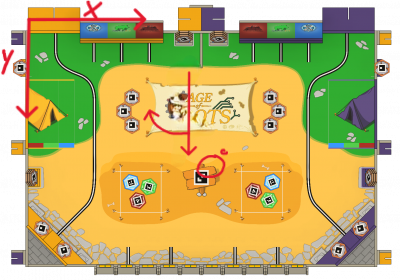

# AI-Robot-Learning

## Overview

This repository contains the code for moving a robot through a map containing obstacles. The robot first calculate the
path to the goal using the A* algorithm, then it moves through the map by piloting the robot wheels with speed control
and making curves if possible.

The final goal is to move from a position A to B, as fast as possible without hitting any obstacles.

> Note: The GUI is in rough state

## Map

